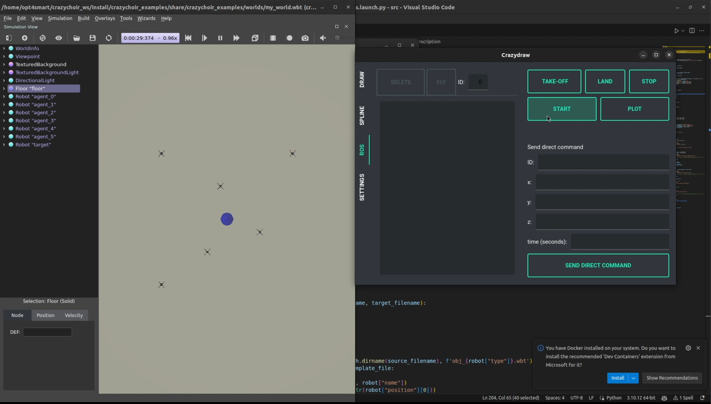

# Docker Installation of **CrazyChoir** 🐋

This README provides instructions on how to dockerize the CrazyChoir repository by building a Docker image and creating a Docker container.

## Prerequisites

This Docker utils has been tested on the following configuration:
- ✅ Nvidia Driver 535.183.01 
- ✅ CUDA 12.2 
- ✅ Docker 24.0.5
- ✅ Docker Compose 2.20.2
- ✅ NVIDIA Container Toolkit CLI 1.14.3
- ✅ Ubuntu 20.04 LTS Focal Fossa
    

### Nvidia drivers

Check your NVIDIA driver version:

```bash
nvidia-smi
```

The output should be something like this:

```bash
+---------------------------------------------------------------------------------------+
| NVIDIA-SMI 535.183.01             Driver Version: 535.183.01   CUDA Version: 12.2     |
|-----------------------------------------+----------------------+----------------------+
| GPU  Name                 Persistence-M | Bus-Id        Disp.A | Volatile Uncorr. ECC |
| Fan  Temp   Perf          Pwr:Usage/Cap |         Memory-Usage | GPU-Util  Compute M. |
|                                         |                      |               MIG M. |
|=========================================+======================+======================|
|   0  NVIDIA GeForce GTX 1050        Off | 00000000:01:00.0 Off |                  N/A |
| N/A   63C    P3              N/A / ERR! |    534MiB /  4096MiB |      0%      Default |
|                                         |                      |                  N/A |
+-----------------------------------------+----------------------+----------------------+
                                                                                         
+---------------------------------------------------------------------------------------+
| Processes:                                                                            |
|  GPU   GI   CI        PID   Type   Process name                            GPU Memory |
|        ID   ID                                                             Usage      |
|=======================================================================================|
|    0   N/A  N/A      2573      G   /usr/lib/xorg/Xorg                          237MiB |
|    0   N/A  N/A      2864      G   /usr/bin/gnome-shell                         65MiB |
|    0   N/A  N/A     85691      G   ...erProcess --variations-seed-version       90MiB |
|    0   N/A  N/A     86163      G   ...irefox/4451/usr/lib/firefox/firefox      138MiB |
+---------------------------------------------------------------------------------------+
```

If not, install the driver by running
```bash
sudo apt install nvidia-driver-535 nvidia-dkms-535
```
then restart your pc. 

> NOTE: there are several methods to install the nvidia driver, however the one above is recommended for a fresh installation. Other methods can cause ubuntu to freeze at boot time, check this [discussion](https://docs.nvidia.com/datacenter/cloud-native/container-toolkit/latest/install-guide.html) if that ever happens to you. 

Now, run
```bash
glxinfo | grep "OpenGL"
```
to check if a hardware accelerated driver is installed. The output should be:

```bash
OpenGL vendor string: NVIDIA Corporation
OpenGL renderer string: NVIDIA GeForce GTX 1050/PCIe/SSE2
OpenGL core profile version string: 4.6.0 NVIDIA 535.183.01
OpenGL core profile shading language version string: 4.60 NVIDIA
OpenGL core profile context flags: (none)
OpenGL core profile profile mask: core profile
OpenGL core profile extensions:
OpenGL version string: 4.6.0 NVIDIA 535.183.01
OpenGL shading language version string: 4.60 NVIDIA
OpenGL context flags: (none)
OpenGL profile mask: (none)
OpenGL extensions:
OpenGL ES profile version string: OpenGL ES 3.2 NVIDIA 535.183.01
OpenGL ES profile shading language version string: OpenGL ES GLSL ES 3.20
OpenGL ES profile extensions:
```
If in the first two lines your NVIDIA card does not appear, then try to select it as the prime GPU with 
```bash
sudo prime-select nvidia
```
then, restart your pc.

### Docker and NVIDIA Container Toolkit

Check your docker version.
```bash
docker --version
```
>NOTE: if docker is not installed, follow the official [guidelines](https://docs.docker.com/engine/install/ubuntu/). 

Check also the NVIDIA Container Toolkit.
```bash
nvidia-ctk --version
```

>NOTE: if nothing appears, follow the official [guidelines](https://docs.nvidia.com/datacenter/cloud-native/container-toolkit/latest/install-guide.html) to install the **NVIDIA Container Toolkit**

If everything is ok, you can start playing with Docker!


## Building the Docker Image

Before building the Docker image, make sure you have cloned the CrazyChoir repository in a directory named `crazychoir_ws/src/`.

>NOTE: If not, clone the repository as explained in the official [installation page](https://opt4smart.github.io/crazychoir/installation).

To build our Docker image for CrazyChoir, execute the following command in the terminal from the `root` directory of the repository:

```bash
bash crazychoir_ws/src/docker/buildImage crazychoir_ws/src/docker <image_name>:<tag>
```

where `<image_name>:<tag>` is the name you want to give to the Docker image. For example, you can name it `crazychoir_image:1.0`.

This command runs the `Dockerfile` located in the `crazychoir_ws/src/docker`.

The building process can take a while (10-20mins), so be patient!

## Creating a Docker Container

After the image is built, create a Docker container with the following command:

```bash
bash crazychoir_ws/src/docker/createContainer <container_name> <image_name>:<tag>
```

where `<container_name>` is the name you want to give to the Docker container. For example, you can name it `crazychoir_container`.

Once the container is created, you can start exploting the toolbox.


## Running the Docker Container

If you have already created the container, you can start it by running the following command:

```bash
docker start <container_name>
```

where `<container_name>` is the name you gave to the Docker container when you created it.

Then, you can open a shell in the container by running the following command:

```bash
docker exec -it <container_name> /bin/bash
```

This command opens an interactive shell in the container, allowing you to run commands and receive output from the container.

## Running the CrazyChoir Examples

Once you have opened a shell in the container, you can run the CrazyChoir examples by following these steps:

```bash
colcon build --symlink-install
source install/setup.bash
ros2 launch crazychoir_examples task_assignment_webots.launch.py
```
Your monitor should display something like that

<p style="text-align:center">
  
</p>

Now, press `TAKE-OFF` to let the crazyflies hover at a fixed position, and then press `START` to run the distributed algorithm.


_Have fun!_ 🚀
